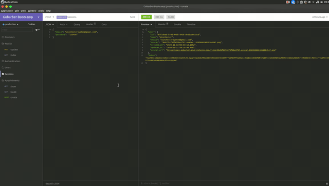

# Gobarber API




Essa API tem é integrado com o projeto [Gobarber Web](https://github.com/apteles/gobarber-web)

## Funcionalidades!

- Autenticação/Redefinição de Senha.
- Criação de usuários.
- Administração de agendamentos.
- Autenticação via token JWT.
- Integração com Amazon ses
- Cache com Redis

## Conceitos

 - SOLID
 - DDD
 - CI/CD

## Tecnologias

- [Express]().
- [Bcrypt]().
- [Jsonwebtoken]().
- [TypeORM]().
- [Yup]().
- [Typescript]().
- [Jest (tests)]().
- [Docker]().
- [Mongo]().
- [Postgres]().
- [tsyringe (Container de Injeção de dependências)]().


## Infraestrutura de Desenvolvimento

- [Docker]().
- [Docker Compose]().

## Produção

- [Docker]().
- [Postgres]().
- [Nginx (Proxy)]().
- [PM2 (Process Manager)]().
- [CI/CD com Github Actions]().

## Executando o projeto localmente

Com o `docker` e `docker-compose` instalado em sua máquina basta apenas executar o seguinte comando:

```sh
$ docker-compose up -d
```

## Testes


Foi aplicado o mínimo de cenários de testes na aplicação. Veja uma exemplo
de como rodar os testes:

```sh
❯ yarn test

```

## Licença


